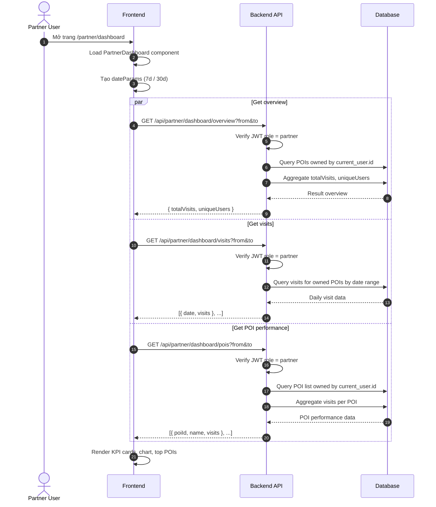
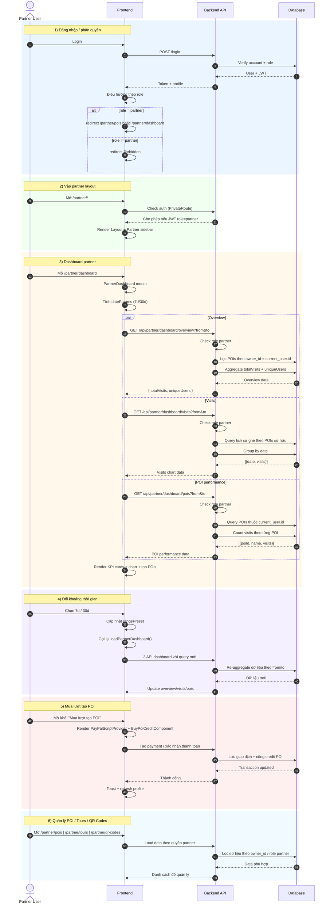
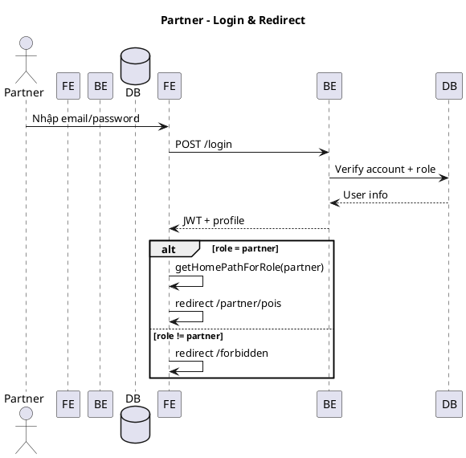
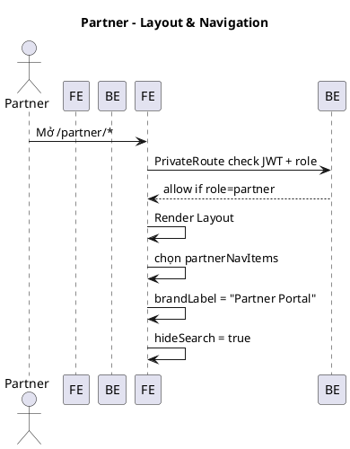
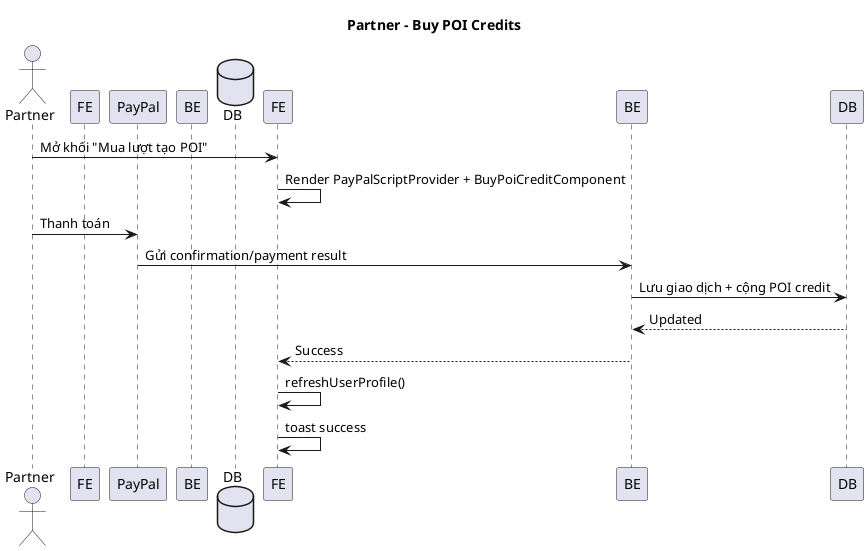
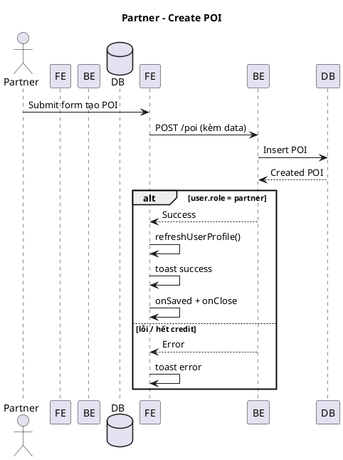
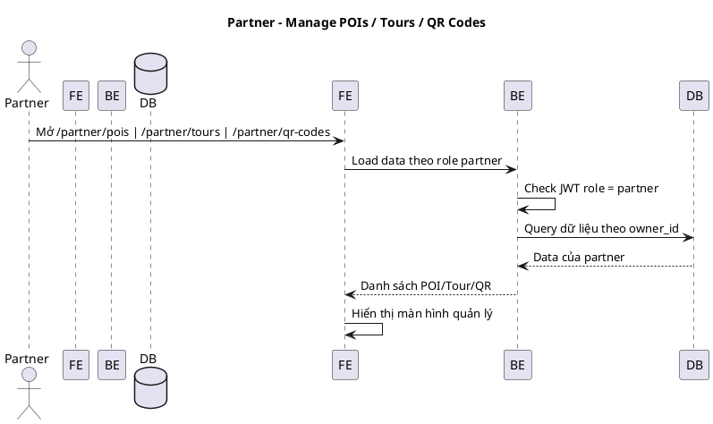

**User:**

vẽ sequence diagram cho role partner từ FE, BE, DB

---

**Assistant:**

Dưới đây là sequence diagram cho role **partner** theo flow **FE → BE → DB** của dashboard partner:



Logic chính từ repo:

- FE gọi 3 API song song bằng `Promise.all(...)`
- Endpoint partner:
  - `GET /api/partner/dashboard/overview`
  - `GET /api/partner/dashboard/visits`
  - `GET /api/partner/dashboard/pois`
- Tất cả endpoint partner đều filter theo:
  - `Pois.owner_id = current_user.id`

Nguồn:
- `src/pages/PartnerDashboard.tsx:38-45`
- `src/services/dashboard.service.ts:47-58`
- `.agent/analystics.md:127-131, 237-271`

Nếu bạn muốn, mình có thể vẽ thêm bản **sequence diagram riêng cho luồng đăng nhập partner** hoặc **luồng tạo POI / QR code**.

---

**User:**

làm toàn bộ chức năng, chia ra các khối

---

**Assistant:**

Đây là sơ đồ **toàn bộ chức năng partner**, chia theo **các khối** FE → BE → DB:



### Chia khối chức năng partner
1. **Auth / phân quyền**
   - Login
   - JWT role check
   - Redirect theo role

2. **Partner layout**
   - Sidebar riêng cho partner
   - Ẩn search
   - Brand: `Partner Portal`

3. **Dashboard**
   - Overview
   - Visits chart
   - Top POIs
   - Load song song 3 API

4. **Filter thời gian**
   - `7d` / `30d`
   - Reload toàn bộ dashboard

5. **Mua credit tạo POI**
   - PayPal
   - Cộng lượt tạo POI
   - Refresh profile sau khi mua

6. **Quản lý POI / Tours / QR**
   - Màn hình quản lý theo quyền partner
   - Chỉ thấy dữ liệu thuộc `owner_id`

Nguồn chính:
- `src/App.tsx:34-46`
- `src/components/Layout.tsx:18-35`
- `src/pages/PartnerDashboard.tsx:38-60`
- `src/services/dashboard.service.ts:47-58`
- `src/modals/CreatePoiModal.tsx:91-99`
- `src/contexts/AuthContext.tsx:151-159`

Nếu bạn muốn, mình có thể tiếp tục **vẽ thành 2–3 sequence diagram riêng biệt**:
- **Login + redirect partner**
- **Partner dashboard**
- **Create POI / QR / Buy credit**

---

**User:**

xuất plantUML, chia làm nhiều phần cho đỡ dài

---

**Assistant:**

Dưới đây là bản **PlantUML**, mình chia thành nhiều phần cho đỡ dài.

---

### 1) Login + redirect theo role partner


---

### 2) Vào partner layout


---

### 3) Partner dashboard load dữ liệu
```plantuml
@startuml
title Partner - Dashboard Load Data

actor Partner
participant FE as Frontend
participant BE as Backend
database DB as Database

Partner -> FE : Mở /partner/dashboard
FE -> FE : Mount PartnerDashboard
FE -> FE : build dateParams (7d/30d)

par Overview
  FE -> BE : GET /api/partner/dashboard/overview?from&to
  BE -> BE : Check role partner
  BE -> DB : Query POIs by owner_id
  BE -> DB : Aggregate totalVisits + uniqueUsers
  DB --> BE : Overview result
  BE --> FE : { totalVisits, uniqueUsers }
and Visits
  FE -> BE : GET /api/partner/dashboard/visits?from&to
  BE -> BE : Check role partner
  BE -> DB : Query history by owned POIs
  BE -> DB : Group by date
  DB --> BE : Daily visits
  BE --> FE : [{ date, visits }]
and POI performance
  FE -> BE : GET /api/partner/dashboard/pois?from&to
  BE -> BE : Check role partner
  BE -> DB : Query owned POIs
  BE -> DB : Count visits per POI
  DB --> BE : POI performance
  BE --> FE : [{ poiId, name, visits }]
end

FE -> FE : Render KPI cards + chart + top POIs

@enduml
```

---

### 4) Đổi khoảng thời gian filter
```plantuml
@startuml
title Partner - Change Date Range

actor Partner
participant FE as Frontend
participant BE as Backend
database DB as Database

Partner -> FE : Chọn 7d / 30d
FE -> FE : setRangePreset()
FE -> FE : rebuild dateParams
FE -> FE : reload dashboard

par Reload overview
  FE -> BE : GET /api/partner/dashboard/overview?from&to
  BE -> DB : Re-aggregate data
  DB --> BE : New overview
  BE --> FE : overview
and Reload visits
  FE -> BE : GET /api/partner/dashboard/visits?from&to
  BE -> DB : Re-aggregate visits
  DB --> BE : New visits
  BE --> FE : visits
and Reload pois
  FE -> BE : GET /api/partner/dashboard/pois?from&to
  BE -> DB : Re-aggregate POI stats
  DB --> BE : New POI stats
  BE --> FE : pois
end

@enduml
```

---

### 5) Mua lượt tạo POI


---

### 6) Tạo POI


---

### 7) Quản lý POI / Tours / QR Codes


---

Nếu bạn muốn, mình có thể gộp lại thành **1 file PlantUML duy nhất** với nhiều `@startuml ... @enduml`, hoặc chỉnh style cho đẹp hơn theo format:
- **sequence**
- **activity**
- **component**