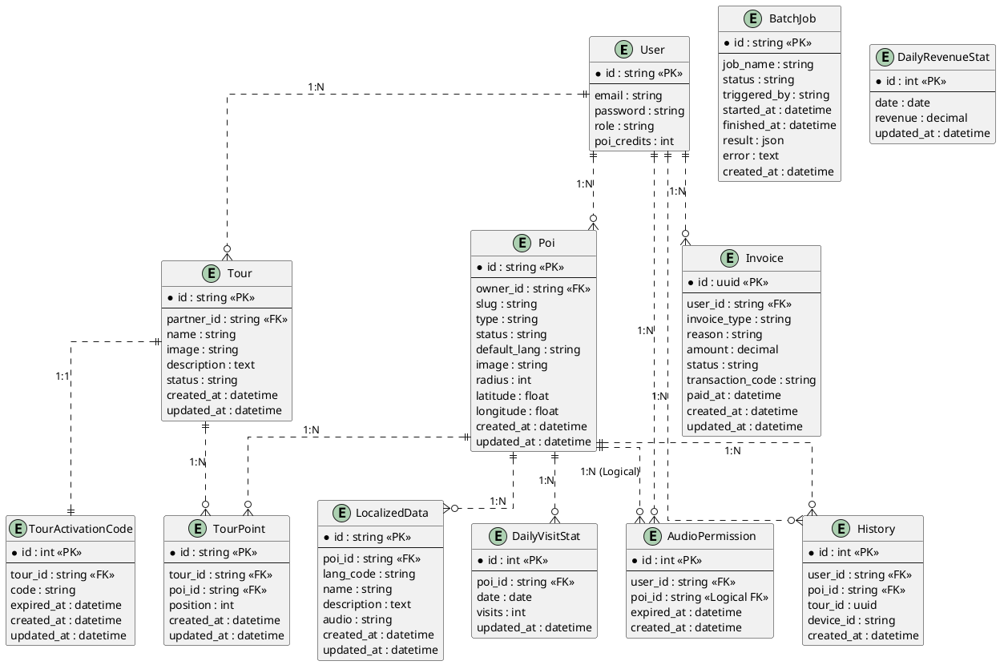

Edited baocao.md
Viewed models.py:1-41
Viewed models.py:1-77
Viewed models.py:1-81
Viewed models.py:1-61
Viewed models.py:1-18
Viewed models.py:1-86

```plantuml
@startuml
skinparam linetype ortho

entity "User" as user {
  * id : string <<PK>>
  --
  email : string
  password : string
  role : string
  poi_credits : int
}

entity "Tour" as tour {
  * id : string <<PK>>
  --
  partner_id : string <<FK>>
  name : string
  image : string
  description : text
  status : string
  created_at : datetime
  updated_at : datetime
}

entity "TourPoint" as tour_point {
  * id : string <<PK>>
  --
  tour_id : string <<FK>>
  poi_id : string <<FK>>
  position : int
  created_at : datetime
  updated_at : datetime
}

entity "TourActivationCode" as tour_activation_code {
  * id : int <<PK>>
  --
  tour_id : string <<FK>>
  code : string
  expired_at : datetime
  created_at : datetime
  updated_at : datetime
}

entity "Poi" as poi {
  * id : string <<PK>>
  --
  owner_id : string <<FK>>
  slug : string
  type : string
  status : string
  default_lang : string
  image : string
  radius : int
  latitude : float
  longitude : float
  created_at : datetime
  updated_at : datetime
}

entity "LocalizedData" as localized_data {
  * id : string <<PK>>
  --
  poi_id : string <<FK>>
  lang_code : string
  name : string
  description : text
  audio : string
  created_at : datetime
  updated_at : datetime
}

entity "AudioPermission" as audio_permission {
  * id : int <<PK>>
  --
  user_id : string <<FK>>
  poi_id : string <<Logical FK>>
  expired_at : datetime
  created_at : datetime
}

entity "Invoice" as invoice {
  * id : uuid <<PK>>
  --
  user_id : string <<FK>>
  invoice_type : string
  reason : string
  amount : decimal
  status : string
  transaction_code : string
  paid_at : datetime
  created_at : datetime
  updated_at : datetime
}

entity "History" as history {
  * id : int <<PK>>
  --
  user_id : string <<FK>>
  poi_id : string <<FK>>
  tour_id : uuid
  device_id : string
  created_at : datetime
}

entity "BatchJob" as batch_job {
  * id : string <<PK>>
  --
  job_name : string
  status : string
  triggered_by : string
  started_at : datetime
  finished_at : datetime
  result : json
  error : text
  created_at : datetime
}

entity "DailyVisitStat" as daily_visit_stat {
  * id : int <<PK>>
  --
  poi_id : string <<FK>>
  date : date
  visits : int
  updated_at : datetime
}

entity "DailyRevenueStat" as daily_revenue_stat {
  * id : int <<PK>>
  --
  date : date
  revenue : decimal
  updated_at : datetime
}

' Relationships
user ||..o{ tour : "1:N"
user ||..o{ poi : "1:N"
user ||..o{ invoice : "1:N"
user ||..o{ history : "1:N"
user ||..o{ audio_permission : "1:N"

tour ||..|| tour_activation_code : "1:1"
tour ||..o{ tour_point : "1:N"
poi ||..o{ tour_point : "1:N"

poi ||..o{ localized_data : "1:N"
poi ||..o{ audio_permission : "1:N (Logical)"
poi ||..o{ history : "1:N"
poi ||..o{ daily_visit_stat : "1:N"

@enduml
```