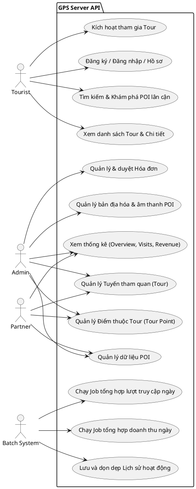
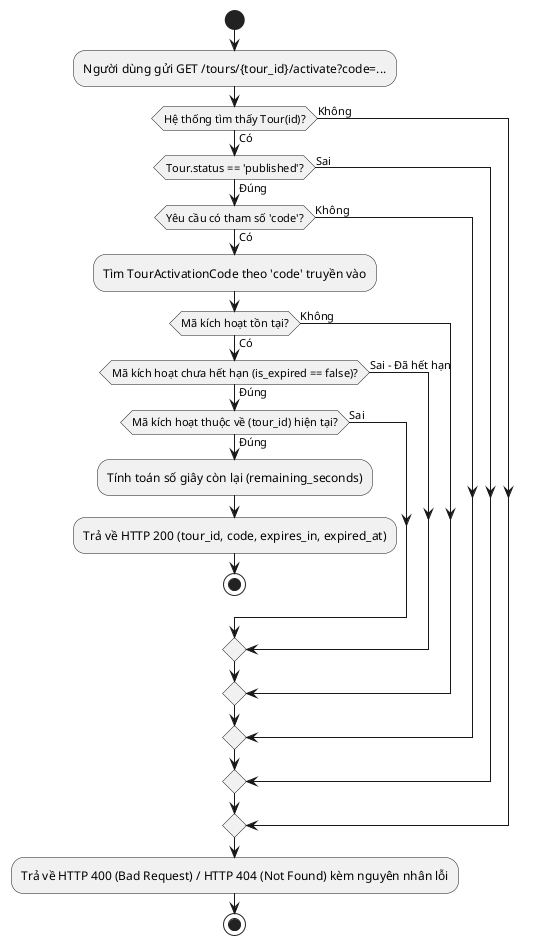
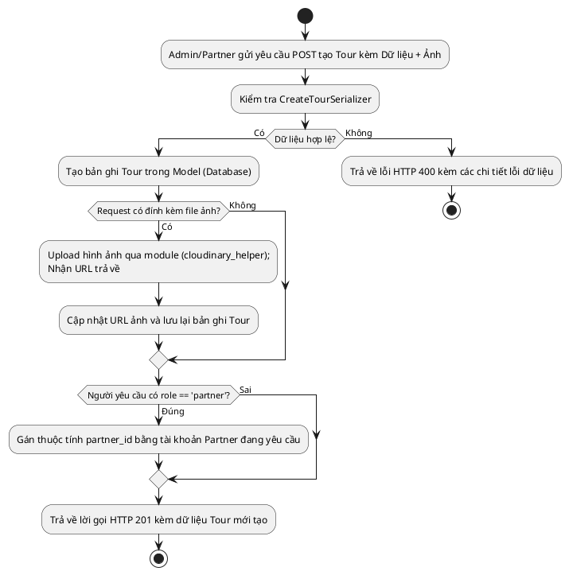
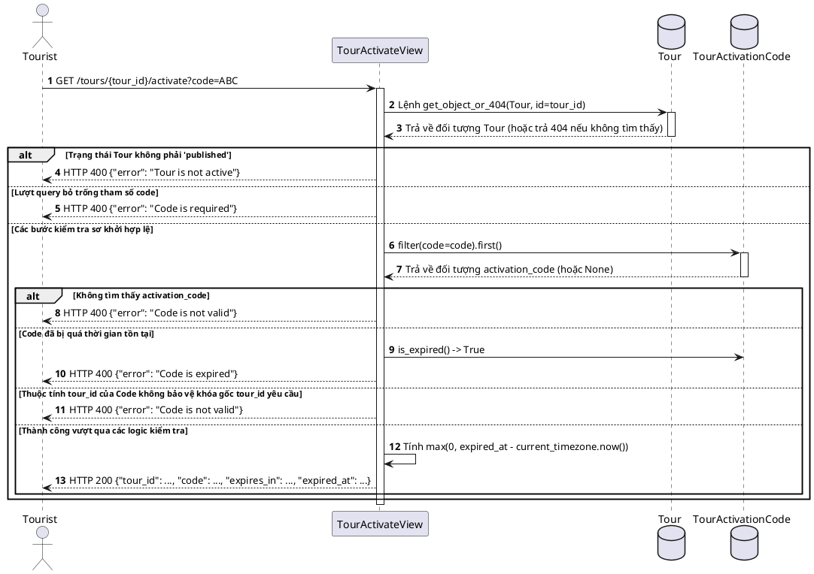

Edited erd.md
Viewed views.py:1-478

Dưới đây là các biểu đồ thiết kế (Use Case, Activity, Sequence) dựa hoàn toàn vào hệ thống mã nguồn hiện tại của các controllers (views), services (celery/batch tasks), và entities (models).

## 3. Use Case Diagram

Sơ đồ Use Case thể hiện tương tác của các tác nhân (Actor) đối với hệ thống, chia theo vai trò cấu hình trong model hiện tại (`admin`, `partner`, `tourist` và hệ thống xử lý ngầm `Batch System`).

## 4. Activity Diagram

Một số luồng chính đáng chú ý nhất dựa trên logic code tại `views.py`.

### Luồng 1: Người dùng Kích hoạt Tour (Dựa theo `TourActivateView.get`)

### Luồng 2: Admin/Partner tạo Tour mới (Dựa theo `AdminTourListCreateView.post`)

## 5. Sequence Diagram

Chức năng "Kích hoạt Tour" với tính logic xử lý quan trọng liên quan đến Code và thời gian (Expiration).

